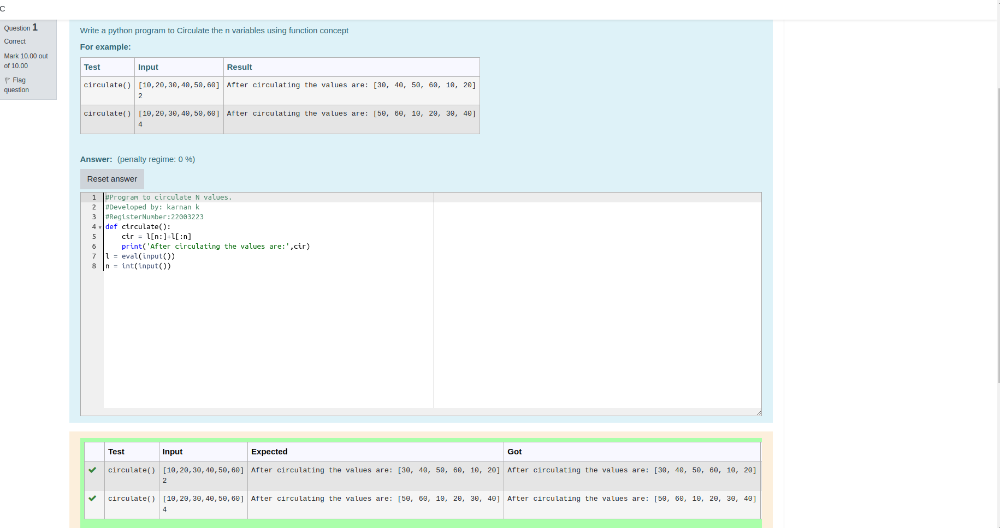

# Circulate-the-values-of-N-variables
## Aim:
To write a python program to circulate the n variables using function concept
## Equipment’s required:
PC
Anaconda - Python 3.7
## Algorithm:  
### Step 1: 
Get the value from the user for the number of rotation
### Step 2: 
Using the slicing concept rotate the list
### Step 3: 
end the program
## Program:
```python
#Program to circulate N values.
#Developed by: karnan k
#RegisterNumber:22003223
def circulate():
    cir = l[n:]+l[:n]
    print('After circulating the values are:',cir)
l = eval(input())
n = int(input()) 
```
## Output:

## Result:
thus the circulate the n variables are successfully executed
